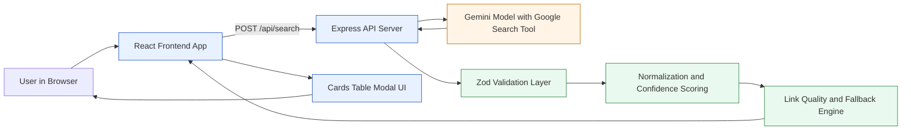
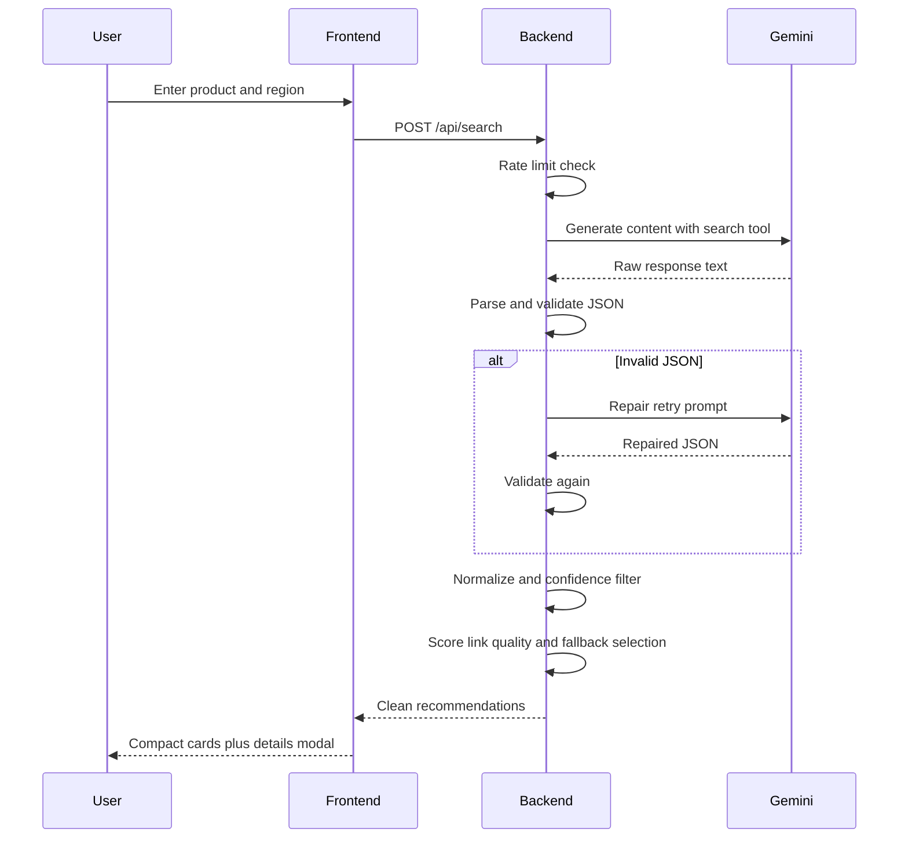
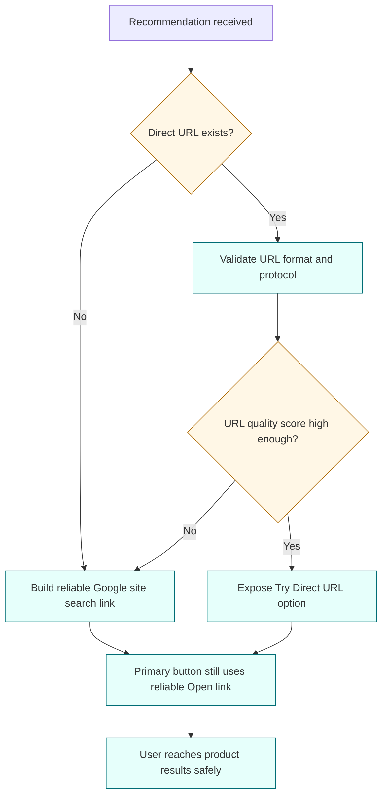

# Deal Finder Visual Diagrams

## 1. System Architecture

```mermaid
flowchart LR
    U[User in Browser]
    FE[React Frontend App]
    API[Express API Server]
    GEM[Gemini Model with Google Search Tool]
    VAL[Zod Validation Layer]
    NORM[Normalization and Confidence Scoring]
    LINK[Link Quality and Fallback Engine]
    UI[Cards Table Modal UI]

    U --> FE
    FE -->|POST /api/search| API
    API --> GEM
    GEM --> API
    API --> VAL
    VAL --> NORM
    NORM --> LINK
    LINK --> FE
    FE --> UI
    UI --> U

    classDef core fill:#e8f1ff,stroke:#2457c5,stroke-width:1px
    classDef ai fill:#fff4e6,stroke:#c46b00,stroke-width:1px
    classDef safe fill:#eaf9ef,stroke:#2e8540,stroke-width:1px

    class FE,API,UI core
    class GEM ai
    class VAL,NORM,LINK safe
```

## 2. Search Request Lifecycle

```mermaid
sequenceDiagram
    participant User
    participant Frontend
    participant Backend
    participant Gemini

    User->>Frontend: Enter product and region
    Frontend->>Backend: POST /api/search
    Backend->>Backend: Rate limit check
    Backend->>Gemini: Generate content with search tool
    Gemini-->>Backend: Raw response text
    Backend->>Backend: Parse and validate JSON
    alt Invalid JSON
        Backend->>Gemini: Repair retry prompt
        Gemini-->>Backend: Repaired JSON
        Backend->>Backend: Validate again
    end
    Backend->>Backend: Normalize and confidence filter
    Backend->>Backend: Score link quality and fallback selection
    Backend-->>Frontend: Clean recommendations
    Frontend-->>User: Compact cards plus details modal
```

## 3. Link Decision Logic

```mermaid
flowchart TD
    A[Recommendation received] --> B{Direct URL exists?}
    B -- No --> F[Build reliable Google site search link]
    B -- Yes --> C[Validate URL format and protocol]
    C --> D{URL quality score high enough?}
    D -- No --> F
    D -- Yes --> E[Expose Try Direct URL option]
    E --> G[Primary button still uses reliable Open link]
    F --> G
    G --> H[User reaches product results safely]

    classDef decision fill:#fff7e6,stroke:#ad6800,stroke-width:1px
    classDef action fill:#e6fffb,stroke:#006d75,stroke-width:1px

    class B,D decision
    class C,E,F,G,H action
```
